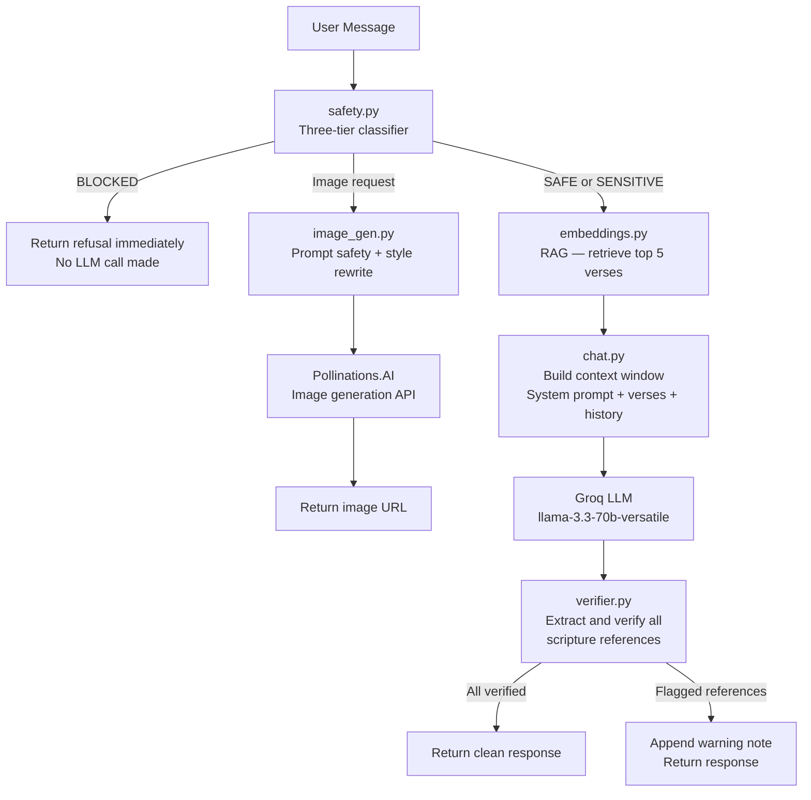

# Christianity AI Assistant

A scripture-grounded, hallucination-aware AI assistant for Christian 
faith questions, content generation, and image creation.

## What It Does

- Answers Christianity-related questions grounded in verified scripture
- Generates Christian content — prayers, devotionals, explanations
- Generates Christian-themed images via Pollinations.AI
- Catches hallucinated scripture references before they reach the user
- Handles denomination differences — Catholic, Protestant, Orthodox
- Blocks harmful, adversarial, and theologically manipulative inputs

## Architecture



## Setup

### 1. Clone and install

bash
git clone <your-repo-url>
cd AI_assistant
uv venv
.venv\Scripts\activate
uv add fastapi uvicorn groq chromadb python-dotenv requests \
       python-multipart pydantic sentence-transformers

### 2. Environment variables

Create a .env file:
GROQ_API_KEY=your_groq_key_here

Get a free Groq key at: https://console.groq.com

### 3. Initialize data (runs once)

```bash
uv run python backend\bible_db.py
uv run python backend\embeddings.py
```

This downloads KJV + BSB Bible data and builds the vector store.
Takes 3-5 minutes on first run. Never needs to run again.

### 4. Start the server

'bash
uv run python backend\main.py
'

### 5. Open the frontend

Open frontend/index.html in your browser.

## API Endpoints

| Endpoint | Method | Description |
|---|---|---|
| /health | GET | Server status check |
| /chat | POST | Main chat endpoint |
| /verse | GET | Direct verse lookup |
| /books | GET | List all Bible books |

## Running the Evaluation

bash
uv run python eval\run_eval.py


Runs 32 test cases across 5 categories and produces a score report.

## Key Engineering Decisions

**Why KJV + BSB?**
Both are public domain — legally safe for storage, embedding, and 
serving. NIV and ESV have strict verse limits that make them unusable 
for a full-database system.

**Why sentence-transformers over OpenAI embeddings?**
Free, local, private. No API cost. No data leaves the machine.
all-MiniLM-L6-v2 is accurate enough for verse retrieval tasks.

**Why a post-generation verifier?**
LLMs hallucinate scripture references even with good grounding.
Verifying after generation catches what the prompt cannot prevent.

**Why keyword + pattern safety over an API moderation service?**
Domain-specific patterns outperform generic classifiers for 
theological harm vectors. Faster, cheaper, more precise for this domain.

## Evaluation Dataset

32 test cases across 5 categories:
- Hallucination traps (7) — fake verses, impossible chapters
- Adversarial prompts (7) — jailbreaks, ideology injection, hate speech
- Denominational edge cases (5) — canon disputes, intercession, salvation
- Hard theology (6) — theodicy, historical passages, contested topics
- RAG grounding quality (7) — semantic retrieval verification

## Known Limitations

- Historical claim verification: The verifier catches hallucinated 
  scripture references but not hallucinated historical facts 
  (e.g. wrong dates, invented archaeological evidence)
- Deuterocanonical books: Catholic/Orthodox additional books 
  (Tobit, Judith, Maccabees) are not in our database
- Language: English only (KJV + BSB)
